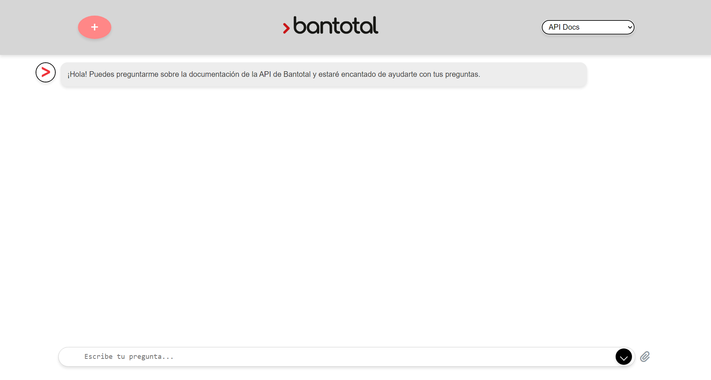

# Cliente para Asistentes

Este código sirve como ejemplo de un cliente para el servidor de asistentes implementado en el otro proyecto. Este cliente consiste en una aplicación desarrollada con REACT con Vite, permitiendo una visualización simple de chat para la comunicación con los asistentes.

## Ejecución Local

### Clona este repositorio:

```bash
git clone git@git.dlya.com.uy:ialabs/btasistentes.git
```


### Variables de Entorno

Asegúrate de tener un archivo `.env` en el directorio raíz según lo descrito en la subsección [.env](#env)


### Ejecuta la APP:

```bash
npm run dev
```

El servidor quedará corriendo en `http://localhost:5000`.
## Uso en Azure

Este cliente esa levantado en Azure y puede ser accedido en el siguiente link [https://bantotalapp.azurewebsites.net/](https://bantotalapp.azurewebsites.net/).


## Modo de Uso

La aplicación comienza con una pantalla de LogIn, la cual precisa credenciales que son verificadas ante el endpoint de SGR `https://support.dlya.com.uy/SGRAPI/rest/loginCentroDeSoporte`

Una vez loggeado, la aplicación consiste en una única pantalla en la cual se realiza la completa interacción con los diferentes asistentes. 




### Enviar mensaje

Para enviar mensaje, es simplemente escribir el mensaje deseado en la barra de chat en la parte inferior de la pantalla, y apretar el botón `ENTER` o clickear en el botón de enviar.

### Nuevo chat

Al clickear en el botón rojo con un símbolo de `+` en la parte superior izquierda, se eliminan todos los mensajes del chat, iniciando uno nuevo. 

### Cambiar Asistente

Para cambiar asistente, se debe clickear en el drop-down menu en la parte superior derecha de la pantalla, en donde apareceran los diferentes asistentes disponibles para utilizar. Al cambiar de asistente se borran todos los mensajes actuales

### Adjuntar archivo

Al clickear en el botón con símbolo de un clip en la parte inferior derecha de la pantalla se habilita subir un documento. Solo se aceptan documentos de tipo _.pdf_ y _.docx_. Ademas, esta funcionalidad esta dispoinble unicamente para los asistentes que precisen subirle un archivo.

## Configuración

Hay dos archivos que permiten configuración aspectos de la página. 

### `.env`

El archivo `.env` contiene las variables de entorno, las cuales permiten configurar tres variables:

- `VITE_ASISTENTES_URL`: Indica el URL donde se encuentra levantado el servidor con los asistentes.
- `VITE_APP_ENDPOINTS`: Consiste en la lista de enpoints de asistentes que se desea mostrar en el drop-down menu de la app. El nombre debe conincidir con el nombre del endpoint del asistente en el servidor. 
- `VITE_APP_UPLOADENDPOINTS`: Indica cual de los endpoints de asistentes se le debe habiliatar el botón para subir archivos. 


### `src/initialFrases.json`

El archivo `initialFrases.json` en la carpeta `src` contiene un JSON donde las keys son los endpoints de los asistentes y el value es la frase de bienvienida del asistente al iniciar un chat con este. 


## Código

El código se encuentra dentro de la carpeta `\src`, donde todo el código que genera la pagina se encuentra en los archivos `app.tsx` y `app.css`. El código no esta modularizado y fue armado a partir de iterar con ChatGPT. No se siguió ninguna práctica estandar de desarrollo de frontend. La idea es que sea lo mínimo necesario como Prueba de Concepto.

